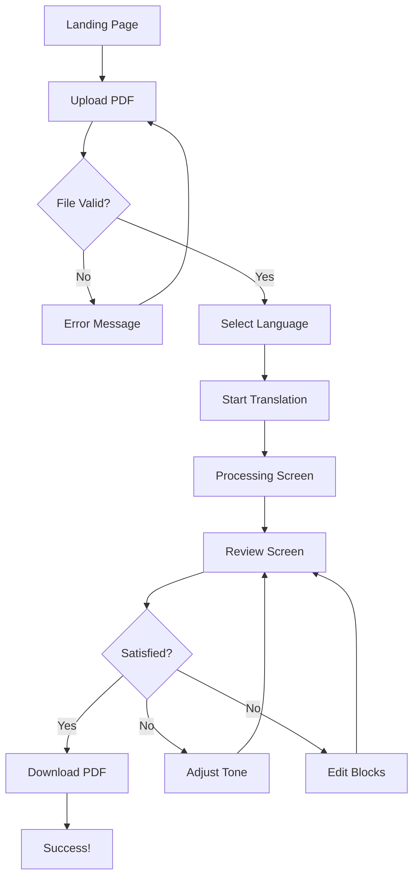
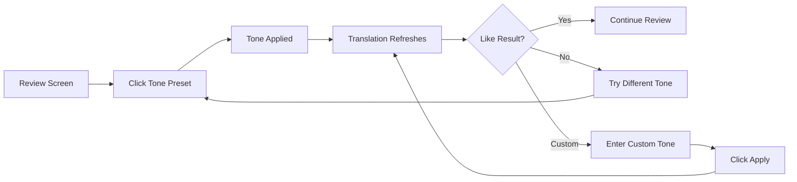
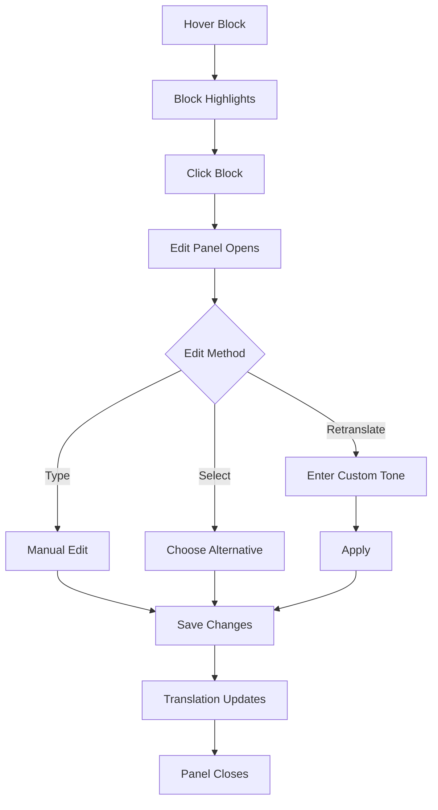

# TransKeep - UX Design Specification

**Created:** December 1, 2025  
**Author:** Roy  
**Platform:** Web (React + shadcn/ui)  
**Design Philosophy:** Confident Clarity  
**Emotional Driver:** Confidence  

---

## Executive Summary

### TransKeep UX Philosophy: "Confident Clarity"

TransKeep empowers users to **trust, control, and perfect** their translations through a design language that prioritizes clarity, control, and premium polish.

**Core Design Pillars:**

1. **Crystal-Clear Review** — Side-by-side comparison with synchronized highlighting makes verification effortless
2. **Visible Control** — Tone presets and editing options are always accessible, never hidden
3. **Instant Feedback** — Every interaction responds immediately with clear visual confirmation
4. **Premium Polish** — Modern, spacious design that signals quality and builds trust

**Design Inspirations:**
- **Figma** — Minimal interface, floating panels, generous whitespace
- **Linear** — Premium feel, fast interactions, sophisticated animations
- **Notion** — Content-first, inline editing, clean typography
- **GitHub** — Side-by-side comparison, synchronized scrolling
- **Grammarly** — Non-intrusive suggestions, one-click apply

**Emotional Goal:** Users feel **confident** because:
- They can **verify** translations instantly (synchronized highlighting)
- They have **control** over tone and wording (visible options)
- They **understand** what's happening (clear feedback)
- The interface feels **professional** and trustworthy (premium design)

---

## 1. Design System Foundation

### 1.1 Design System Choice

**Primary System:** shadcn/ui + Radix UI Primitives + Tailwind CSS

**Why this combination:**

| Aspect | shadcn/ui Benefit |
|--------|-------------------|
| **Accessibility** | Built on Radix UI primitives (WCAG compliant by default) |
| **Customization** | Headless components allow full visual control |
| **Performance** | No runtime CSS-in-JS, Tailwind compiles to minimal CSS |
| **Developer Experience** | Copy-paste components, full ownership |
| **Design Quality** | Modern aesthetic out of the box |
| **React Ecosystem** | Perfect fit for React 18 + TypeScript |

**Components we'll use from shadcn/ui:**
- Button (primary, secondary, ghost, destructive variants)
- Card (panels, containers)
- Dialog (modals)
- Dropdown Menu (language selection, settings)
- Input, Textarea (custom tone input)
- Progress (upload/translation progress)
- Tabs (view switching)
- Toast (notifications)
- Tooltip (contextual help)
- Select (language picker)
- Separator (visual dividers)

**Custom components we'll build:**
- `ReviewPanel` — Dual PDF viewer with synchronized highlighting
- `ToneSelector` — Horizontal preset buttons + custom input
- `EditPanel` — Inline text editor with alternatives
- `HighlightOverlay` — Hover-triggered block highlighting
- `ProgressStepper` — Multi-step progress indicator

---

### 1.2 Core Design Principles

**1. Confidence Through Clarity**
- Every element has a clear purpose
- Visual hierarchy guides attention naturally
- No ambiguity in what actions do

**2. Content Dominates**
- Documents occupy 80%+ of viewport
- Controls float or collapse when not needed
- Interface "disappears" during review

**3. Instant Response**
- Hover highlighting: < 50ms response
- Button clicks: immediate visual feedback
- No loading spinners for UI interactions

**4. Generous Space**
- 24px base spacing unit
- Ample padding in all containers
- Whitespace is intentional, not wasted

**5. Subtle Motion**
- Transitions: 150-200ms ease-out
- No bouncy or flashy animations
- Motion serves function, not decoration

---

## 2. Visual Foundation

### 2.1 Color System

**Design Direction:** Light mode primary with optional dark mode (Phase 2)

**Primary Palette:**

| Token | Value | Usage |
|-------|-------|-------|
| `--background` | `#FAFAFA` | Page background |
| `--foreground` | `#0A0A0A` | Primary text |
| `--card` | `#FFFFFF` | Card/panel backgrounds |
| `--card-foreground` | `#0A0A0A` | Card text |
| `--muted` | `#F4F4F5` | Subtle backgrounds, disabled states |
| `--muted-foreground` | `#71717A` | Secondary text, placeholders |
| `--border` | `#E4E4E7` | Borders, dividers |

**Brand Colors:**

| Token | Value | Usage |
|-------|-------|-------|
| `--primary` | `#0066FF` | Primary actions, focus states, links |
| `--primary-foreground` | `#FFFFFF` | Text on primary |
| `--accent` | `#F0F7FF` | Hover highlights, selected states |
| `--accent-foreground` | `#0066FF` | Text on accent |

**Semantic Colors:**

| Token | Value | Usage |
|-------|-------|-------|
| `--success` | `#10B981` | Success states, completed steps |
| `--success-light` | `#D1FAE5` | Success backgrounds |
| `--warning` | `#F59E0B` | Warnings, large files |
| `--warning-light` | `#FEF3C7` | Warning backgrounds |
| `--destructive` | `#EF4444` | Errors, destructive actions |
| `--destructive-light` | `#FEE2E2` | Error backgrounds |

**Highlight Colors (The Star Feature):**

| Token | Value | Usage |
|-------|-------|-------|
| `--highlight-hover` | `#DBEAFE` | Block hover highlight |
| `--highlight-selected` | `#BFDBFE` | Selected block |
| `--highlight-border` | `#3B82F6` | Highlight border accent |

**Why these colors:**
- **Blue primary** (#0066FF) — Trustworthy, professional, not too corporate
- **Warm grays** — Modern, approachable, Figma-like
- **Subtle highlights** — Clear but not jarring, maintains readability
- **High contrast** — Meets WCAG AA (4.5:1 minimum)

---

### 2.2 Typography System

**Font Stack:**

```css
--font-sans: "Inter", -apple-system, BlinkMacSystemFont, "Segoe UI", 
             "Roboto", "Oxygen", "Ubuntu", sans-serif;
--font-mono: "JetBrains Mono", "Fira Code", "Consolas", monospace;
```

**Why Inter:**
- Designed for screens, excellent readability
- Variable font (performance)
- Modern, clean aesthetic
- Free and widely available

**Type Scale:**

| Level | Size | Weight | Line Height | Usage |
|-------|------|--------|-------------|-------|
| `display` | 36px / 2.25rem | 700 | 1.2 | Landing page hero |
| `h1` | 30px / 1.875rem | 700 | 1.3 | Page titles |
| `h2` | 24px / 1.5rem | 600 | 1.35 | Section headers |
| `h3` | 20px / 1.25rem | 600 | 1.4 | Subsection headers |
| `h4` | 16px / 1rem | 600 | 1.5 | Card titles |
| `body` | 16px / 1rem | 400 | 1.6 | Main content |
| `body-sm` | 14px / 0.875rem | 400 | 1.5 | Secondary content |
| `caption` | 12px / 0.75rem | 500 | 1.4 | Labels, metadata |
| `overline` | 11px / 0.6875rem | 600 | 1.4 | Category labels |

**Principles:**
- 16px minimum for body text (accessibility)
- Generous line height (1.5-1.6) for readability
- Limited scale (8 levels) for consistency
- Weight contrast for hierarchy (400 vs 600 vs 700)

---

### 2.3 Spacing System

**Base Unit:** 4px

**Spacing Scale:**

| Token | Value | Usage |
|-------|-------|-------|
| `--space-0` | 0px | Reset |
| `--space-1` | 4px | Micro spacing, icon gaps |
| `--space-2` | 8px | Tight spacing, inline elements |
| `--space-3` | 12px | Default gap |
| `--space-4` | 16px | Component padding |
| `--space-5` | 20px | Card padding |
| `--space-6` | 24px | Section spacing |
| `--space-8` | 32px | Large gaps |
| `--space-10` | 40px | Section breaks |
| `--space-12` | 48px | Page sections |
| `--space-16` | 64px | Major breaks |
| `--space-20` | 80px | Page-level spacing |

**Application Guidelines:**
- Component internal padding: 16-20px
- Between related elements: 8-12px
- Between sections: 24-32px
- Page margins: 24px (mobile) / 48px (desktop)

---

### 2.4 Shadows & Elevation

**Shadow Scale:**

| Level | Shadow | Usage |
|-------|--------|-------|
| `--shadow-xs` | `0 1px 2px rgba(0,0,0,0.05)` | Subtle lift |
| `--shadow-sm` | `0 1px 3px rgba(0,0,0,0.1), 0 1px 2px rgba(0,0,0,0.06)` | Cards, buttons |
| `--shadow-md` | `0 4px 6px rgba(0,0,0,0.1), 0 2px 4px rgba(0,0,0,0.06)` | Dropdowns |
| `--shadow-lg` | `0 10px 15px rgba(0,0,0,0.1), 0 4px 6px rgba(0,0,0,0.05)` | Modals |
| `--shadow-xl` | `0 20px 25px rgba(0,0,0,0.1), 0 10px 10px rgba(0,0,0,0.04)` | Floating panels |

**Border Radius:**

| Token | Value | Usage |
|-------|-------|-------|
| `--radius-sm` | 4px | Small elements, badges |
| `--radius-md` | 6px | Buttons, inputs |
| `--radius-lg` | 8px | Cards, panels |
| `--radius-xl` | 12px | Large cards, modals |
| `--radius-full` | 9999px | Pills, avatars |

---

### 2.5 Animation & Motion

**Timing Functions:**

```css
--ease-out: cubic-bezier(0.16, 1, 0.3, 1);
--ease-in-out: cubic-bezier(0.45, 0, 0.55, 1);
--ease-spring: cubic-bezier(0.34, 1.56, 0.64, 1);
```

**Duration Scale:**

| Token | Value | Usage |
|-------|-------|-------|
| `--duration-fast` | 100ms | Micro-interactions (hover) |
| `--duration-normal` | 150ms | Standard transitions |
| `--duration-slow` | 250ms | Panel reveals |
| `--duration-slower` | 350ms | Page transitions |

**Motion Principles:**
- Hover states: 100ms (instant feel)
- State changes: 150ms (smooth but quick)
- Panel open/close: 200-250ms (noticeable but not slow)
- No motion for motion's sake

---

## 3. Core User Experience

### 3.1 The Defining Experience: Side-by-Side Review

**THIS IS THE SOUL OF TRANSKEEP.**

The side-by-side review with synchronized highlighting is what makes TransKeep unique. Every design decision should support this experience.

**Core Requirements:**

1. **Dual Panel Layout**
   - Original PDF on left (50% width)
   - Translated PDF on right (50% width)
   - Full viewport height (minus header)
   - Resizable divider (optional, Phase 2)

2. **Synchronized Scrolling**
   - Default: ON (both panels scroll together)
   - Toggle available in toolbar
   - Scroll position mapped by page/block
   - Smooth, no jitter

3. **Hover Highlighting (The Star Feature)**
   - Hover any block in either panel
   - Corresponding block in other panel highlights
   - Highlight color: `--highlight-hover` (#DBEAFE)
   - Transition: 100ms ease-out
   - Border accent on hover: `--highlight-border` (#3B82F6)

4. **Block Mapping**
   - Paragraph level (primary)
   - Table cell level
   - Image caption level
   - Header level
   - List item level

**Visual Specification:**

```
┌─────────────────────────────────────────────────────────────────┐
│  TransKeep                              [Sync] [Zoom] [⋮]       │
├────────────────────────────┬────────────────────────────────────┤
│                            │                                    │
│  ORIGINAL                  │  TRANSLATED                        │
│                            │                                    │
│  ┌────────────────────┐    │  ┌────────────────────────────┐   │
│  │ Lorem ipsum dolor  │    │  │ [翻訳されたテキスト]         │   │
│  │ sit amet...       │◄───┼──►│ [対応するブロック]           │   │
│  └────────────────────┘    │  └────────────────────────────┘   │
│                            │                                    │
│  Regular text here         │  通常のテキストはこちら            │
│                            │                                    │
│  ┌────────────────────┐    │  ┌────────────────────────────┐   │
│  │ [HIGHLIGHTED]      │    │  │ [HIGHLIGHTED]               │   │
│  │ When hovering      │    │  │ ホバー時にハイライト         │   │
│  └────────────────────┘    │  └────────────────────────────┘   │
│                            │                                    │
└────────────────────────────┴────────────────────────────────────┘
│                    REFINEMENT PANEL                              │
│  ┌──────────────────────────────────────────────────────────┐   │
│  │ Tone: ○ Formal  ○ Casual  ● Creative  ○ Technical       │   │
│  │       ○ Academic  [ Custom tone... ]  [Apply]           │   │
│  └──────────────────────────────────────────────────────────┘   │
│                                              [Download PDF]      │
└──────────────────────────────────────────────────────────────────┘
```

---

### 3.2 Interaction Model

**Primary Pattern: "See → Hover → Understand → Refine → Download"**

1. **See** — Both documents displayed simultaneously
2. **Hover** — Explore correspondence between original and translation
3. **Understand** — Verify accuracy through visual mapping
4. **Refine** — Adjust tone or edit specific blocks
5. **Download** — Get polished result with confidence

**Click Behaviors:**

| Element | Click Action | Feedback |
|---------|--------------|----------|
| Text block (translated) | Opens edit panel | Block highlighted, panel slides up |
| Tone preset | Applies tone | Preset fills, translation refreshes |
| Apply button | Confirms changes | Success toast, view updates |
| Download button | Generates PDF | Progress indicator, then download |

**Hover Behaviors:**

| Element | Hover Action | Feedback |
|---------|--------------|----------|
| Text block (either side) | Highlights both corresponding blocks | Background color change (100ms) |
| Button | Shows hover state | Background lightens |
| Tone preset | Shows tooltip with description | Tooltip appears (200ms delay) |

---

## 4. Key Screens & Layouts

### 4.1 Upload Screen

**Purpose:** First impression, invite users to begin

**Layout:** Centered, focused, minimal

```
┌─────────────────────────────────────────────────────────────────┐
│  TransKeep                                    [Sign In]         │
├─────────────────────────────────────────────────────────────────┤
│                                                                 │
│                                                                 │
│                    ┌─────────────────────────┐                  │
│                    │                         │                  │
│                    │     📄                  │                  │
│                    │                         │                  │
│                    │  Drop your PDF here     │                  │
│                    │  or click to browse     │                  │
│                    │                         │                  │
│                    │  Supports up to 100MB   │                  │
│                    │                         │                  │
│                    └─────────────────────────┘                  │
│                                                                 │
│                    Translate to:                                │
│                    ┌─────────────────────────┐                  │
│                    │ Japanese            ▼   │                  │
│                    └─────────────────────────┘                  │
│                                                                 │
│                    ┌─────────────────────────┐                  │
│                    │     Start Translation   │                  │
│                    └─────────────────────────┘                  │
│                                                                 │
│                    2 of 2 free translations remaining           │
│                                                                 │
└─────────────────────────────────────────────────────────────────┘
```

**Specifications:**
- Drop zone: 400px × 280px, dashed border, rounded corners
- Language selector: Full width within container, max 400px
- Primary button: Full width, prominent
- Usage counter: Subtle, below button

---

### 4.2 Processing Screen

**Purpose:** Keep user informed during translation

**Layout:** Centered card with progress

```
┌─────────────────────────────────────────────────────────────────┐
│  TransKeep                                                      │
├─────────────────────────────────────────────────────────────────┤
│                                                                 │
│                    ┌─────────────────────────────┐              │
│                    │                             │              │
│                    │  📄 document.pdf            │              │
│                    │  English → Japanese         │              │
│                    │                             │              │
│                    │  ████████████░░░░░░░░  62%  │              │
│                    │                             │              │
│                    │  Page 31 of 50              │              │
│                    │  ~25 seconds remaining      │              │
│                    │                             │              │
│                    │  ✓ Extracting text          │              │
│                    │  ● Translating...           │              │
│                    │  ○ Applying tone            │              │
│                    │  ○ Reconstructing PDF       │              │
│                    │                             │              │
│                    └─────────────────────────────┘              │
│                                                                 │
└─────────────────────────────────────────────────────────────────┘
```

**Specifications:**
- Progress bar: Full width of card, 8px height, rounded
- Step indicators: Checkmark (done), filled circle (in progress), empty circle (pending)
- Time estimate: Updates every 5 seconds
- Card: max-width 480px, centered

---

### 4.3 Review Screen (The Hero)

**Purpose:** Core experience - review, refine, download

**Layout:** Full viewport, dual panel with bottom refinement

```
┌─────────────────────────────────────────────────────────────────┐
│  TransKeep    document.pdf    [🔗 Sync] [🔍 Zoom] [⚙️]  [👤]    │
├────────────────────────────┬────────────────────────────────────┤
│                            │                                    │
│  ORIGINAL                  │  TRANSLATED                        │
│  ─────────────────────     │  ─────────────────────────────     │
│                            │                                    │
│  [PDF Content]             │  [PDF Content]                     │
│                            │                                    │
│  Lorem ipsum dolor sit     │  翻訳されたテキストが               │
│  amet, consectetur         │  ここに表示されます                 │
│  adipiscing elit...        │  ...                               │
│                            │                                    │
│                            │                                    │
│                            │                                    │
├────────────────────────────┴────────────────────────────────────┤
│  REFINE YOUR TRANSLATION                              [▼ Hide]  │
├─────────────────────────────────────────────────────────────────┤
│                                                                 │
│  Tone:  ○ Formal  ○ Casual  ● Creative  ○ Technical  ○ Academic │
│                                                                 │
│  Custom: [Describe the tone you want...              ] [Apply]  │
│                                                                 │
│  ─────────────────────────────────────────────────────────────  │
│                                                                 │
│  [Edit Selected Block]                        [⬇️ Download PDF] │
│                                                                 │
└─────────────────────────────────────────────────────────────────┘
```

**Panel Specifications:**

| Element | Specification |
|---------|---------------|
| Header height | 56px |
| PDF panels | 50% each, full remaining height |
| Refinement panel | Collapsible, 160px expanded |
| Panel headers | 40px, sticky |
| Scroll sync toggle | Icon button in header |

---

### 4.4 Edit Panel (Overlay)

**Purpose:** Edit specific translation blocks

**Trigger:** Click any block in translated panel

```
┌─────────────────────────────────────────────────────────────────┐
│  Edit Translation                                    [✕ Close]  │
├─────────────────────────────────────────────────────────────────┤
│                                                                 │
│  Original:                                                      │
│  ┌─────────────────────────────────────────────────────────┐   │
│  │ The quick brown fox jumps over the lazy dog.            │   │
│  └─────────────────────────────────────────────────────────┘   │
│                                                                 │
│  Translation:                                                   │
│  ┌─────────────────────────────────────────────────────────┐   │
│  │ 素早い茶色の狐が怠惰な犬を飛び越える。                      │   │
│  └─────────────────────────────────────────────────────────┘   │
│                                                                 │
│  Alternatives:                                                  │
│  ┌─────────────────────────────────────────────────────────┐   │
│  │ ○ 敏捷な茶色のキツネが怠け者の犬を跳び越えた。              │   │
│  ├─────────────────────────────────────────────────────────┤   │
│  │ ○ 茶色の狐が素早く、怠惰な犬の上を跳んだ。                  │   │
│  └─────────────────────────────────────────────────────────┘   │
│                                                                 │
│  Re-translate with tone: [Poetic and elegant...    ] [Apply]   │
│                                                                 │
│  ─────────────────────────────────────────────────────────────  │
│                                                                 │
│  [Cancel]                                    [Save Changes]     │
│                                                                 │
└─────────────────────────────────────────────────────────────────┘
```

**Specifications:**
- Panel type: Slide-up drawer (mobile) or modal (desktop)
- Width: 600px max (desktop), full width (mobile)
- Original text: Read-only, muted background
- Translation: Editable textarea
- Alternatives: Radio button selection

---

## 5. User Journey Flows

### 5.1 Happy Path: Upload → Review → Download



**Journey Emotions:**

| Step | User Feels | Design Response |
|------|------------|-----------------|
| Upload | Curious, hopeful | Inviting drop zone, clear instructions |
| Processing | Anticipation, mild anxiety | Clear progress, time estimate |
| Review | Relief, then scrutiny | Immediate side-by-side, highlighting |
| Refine | Empowered, in control | Easy tone switching, inline editing |
| Download | Satisfied, confident | Success confirmation, quality result |

---

### 5.2 Tone Customization Flow



**Tone Presets:**

| Tone | Description | Use Case |
|------|-------------|----------|
| **Formal** | Professional, precise, respectful | Business documents, official papers |
| **Casual** | Conversational, friendly, relaxed | Blog posts, personal content |
| **Creative** | Literary, expressive, nuanced | Novels, creative writing |
| **Technical** | Accurate, specialized terminology | Manuals, documentation |
| **Academic** | Scholarly, analytical, rigorous | Research papers, academic texts |

---

### 5.3 Edit Block Flow



---

## 6. Component Specifications

### 6.1 Button Component

**Variants:**

| Variant | Background | Text | Border | Usage |
|---------|------------|------|--------|-------|
| `primary` | `--primary` | white | none | Main actions (Download, Apply) |
| `secondary` | transparent | `--foreground` | `--border` | Secondary actions (Cancel) |
| `ghost` | transparent | `--muted-foreground` | none | Tertiary actions |
| `destructive` | `--destructive` | white | none | Dangerous actions |

**Sizes:**

| Size | Height | Padding | Font Size |
|------|--------|---------|-----------|
| `sm` | 32px | 12px 16px | 14px |
| `md` | 40px | 16px 20px | 14px |
| `lg` | 48px | 20px 24px | 16px |

**States:**
- Default: Base styles
- Hover: Lighten background 10%
- Active: Darken background 5%
- Disabled: 50% opacity, no pointer events
- Focus: 2px ring with `--primary` at 50% opacity

---

### 6.2 Tone Selector Component

**Layout:** Horizontal button group + custom input

```
┌──────────────────────────────────────────────────────────────┐
│  Tone:                                                       │
│  ┌────────┬────────┬──────────┬───────────┬──────────┐      │
│  │ Formal │ Casual │ Creative │ Technical │ Academic │      │
│  └────────┴────────┴──────────┴───────────┴──────────┘      │
│                                                              │
│  Custom: ┌────────────────────────────────┐ ┌───────┐       │
│          │ Describe your tone...          │ │ Apply │       │
│          └────────────────────────────────┘ └───────┘       │
└──────────────────────────────────────────────────────────────┘
```

**Preset Button States:**
- Unselected: Ghost style, muted text
- Selected: Primary background, white text
- Hover (unselected): Light background

**Behavior:**
- Single selection (radio-like)
- Clicking preset immediately applies (no confirm)
- Custom requires typing + Apply button

---

### 6.3 Progress Stepper Component

**Layout:** Vertical list with status indicators

```
┌────────────────────────────────────┐
│  ✓  Extracting text      [1.2s]   │
│  ●  Translating...       [~30s]   │
│  ○  Applying tone                 │
│  ○  Reconstructing PDF            │
└────────────────────────────────────┘
```

**Status Indicators:**
- ✓ Complete: Green checkmark, muted text
- ● In Progress: Blue filled circle, normal text, optional spinner
- ○ Pending: Gray empty circle, muted text

---

### 6.4 Highlight Overlay Component

**Purpose:** Visual highlighting for block correspondence

**Behavior:**
1. User hovers block in Panel A
2. Block in Panel A gets highlight background
3. Corresponding block in Panel B gets highlight background
4. Both get subtle border accent
5. On mouse leave, highlights fade out (100ms)

**Styles:**
```css
.block-highlight {
  background-color: var(--highlight-hover);
  border-left: 3px solid var(--highlight-border);
  transition: all 100ms ease-out;
}
```

---

## 7. UX Pattern Decisions

### 7.1 Feedback Patterns

| Scenario | Pattern | Duration |
|----------|---------|----------|
| Button click | Ripple + state change | Instant |
| Form submission | Button loading state | Until complete |
| Success | Toast notification | 3 seconds auto-dismiss |
| Error | Inline message + toast | Persistent until dismissed |
| Progress | Progress bar + percentage | Real-time updates |

### 7.2 Form Patterns

| Aspect | Decision |
|--------|----------|
| Label position | Above input |
| Required indicator | Asterisk (*) |
| Validation timing | On blur + on submit |
| Error display | Inline below field, red text |
| Help text | Below input, muted color |

### 7.3 Modal Patterns

| Aspect | Decision |
|--------|----------|
| Backdrop | Semi-transparent black (50%) |
| Dismiss | Click outside, Escape key, X button |
| Focus | Trap focus within modal |
| Animation | Fade in + scale up (200ms) |

### 7.4 Navigation Patterns

| Aspect | Decision |
|--------|----------|
| Primary nav | Minimal header (logo + user menu) |
| Active state | Bold text, underline accent |
| Back button | Browser back (no custom) |
| Breadcrumbs | Not needed (simple flow) |

### 7.5 Empty State Patterns

| Scenario | Content |
|----------|---------|
| No document | Upload prompt with illustration |
| No alternatives | "No alternatives available" message |
| Error state | Clear message + retry action |

### 7.6 Confirmation Patterns

| Action | Confirmation |
|--------|--------------|
| Delete | Not applicable (no delete in MVP) |
| Leave unsaved | Browser warning on navigation |
| Apply tone | No confirmation (instant apply) |
| Download | No confirmation (instant download) |

---

## 8. Responsive Design

### 8.1 Breakpoints

| Breakpoint | Width | Layout |
|------------|-------|--------|
| `mobile` | < 640px | Single column, stacked |
| `tablet` | 640px - 1024px | Adaptive, may stack |
| `desktop` | > 1024px | Full dual-panel |

### 8.2 Responsive Behaviors

**Review Screen:**

| Viewport | Layout |
|----------|--------|
| Desktop (>1024px) | Side-by-side panels |
| Tablet (640-1024px) | Side-by-side (narrower) or tabs |
| Mobile (<640px) | Tab toggle: Original / Translated |

**Upload Screen:**

| Viewport | Layout |
|----------|--------|
| Desktop | Centered card, max-width 480px |
| Tablet | Centered card, max-width 400px |
| Mobile | Full width with padding |

**Refinement Panel:**

| Viewport | Layout |
|----------|--------|
| Desktop | Horizontal tone buttons, inline custom |
| Mobile | Vertical stack, full-width buttons |

---

## 9. Accessibility

### 9.1 WCAG 2.1 AA Compliance

**Color Contrast:**
- Normal text: 4.5:1 minimum ✓
- Large text: 3:1 minimum ✓
- UI components: 3:1 minimum ✓

**Keyboard Navigation:**
- All interactive elements focusable
- Logical tab order
- Focus indicators visible (2px ring)
- Escape closes modals
- Enter activates buttons

**Screen Reader Support:**
- Semantic HTML (headings, lists, buttons)
- ARIA labels for icons
- Live regions for dynamic content
- Form labels associated with inputs
- Error messages announced

**Motion:**
- Respect `prefers-reduced-motion`
- No auto-playing animations
- No flashing content

### 9.2 Focus Management

**Modal Open:**
1. Store previous focus
2. Move focus to modal
3. Trap focus within modal
4. On close, restore previous focus

**Panel Transitions:**
- Focus moves to new content
- Announce changes to screen readers

---

## 10. Implementation Guidance

### 10.1 Component Architecture

```
src/
├── components/
│   ├── ui/                    # shadcn/ui components
│   │   ├── button.tsx
│   │   ├── card.tsx
│   │   ├── dialog.tsx
│   │   ├── input.tsx
│   │   ├── progress.tsx
│   │   ├── select.tsx
│   │   ├── tabs.tsx
│   │   ├── toast.tsx
│   │   └── tooltip.tsx
│   │
│   ├── layout/                # Layout components
│   │   ├── Header.tsx
│   │   ├── PageContainer.tsx
│   │   └── PanelLayout.tsx
│   │
│   ├── upload/                # Upload feature
│   │   ├── DropZone.tsx
│   │   ├── LanguageSelector.tsx
│   │   └── UploadButton.tsx
│   │
│   ├── processing/            # Processing feature
│   │   ├── ProcessingCard.tsx
│   │   └── ProgressStepper.tsx
│   │
│   ├── review/                # Review feature (core)
│   │   ├── ReviewPanel.tsx
│   │   ├── PDFViewer.tsx
│   │   ├── HighlightOverlay.tsx
│   │   ├── SyncScrollProvider.tsx
│   │   └── BlockMapping.tsx
│   │
│   ├── refinement/            # Refinement feature
│   │   ├── RefinementPanel.tsx
│   │   ├── ToneSelector.tsx
│   │   ├── EditPanel.tsx
│   │   └── AlternativesList.tsx
│   │
│   └── common/                # Shared components
│       ├── LoadingSpinner.tsx
│       ├── ErrorBoundary.tsx
│       └── Toast.tsx
│
├── hooks/
│   ├── usePDFViewer.ts
│   ├── useSyncScroll.ts
│   ├── useBlockHighlight.ts
│   ├── useToneApplication.ts
│   └── useEditMode.ts
│
├── styles/
│   ├── globals.css            # Tailwind imports + CSS variables
│   └── tokens.css             # Design tokens
│
└── lib/
    ├── pdf.ts                 # PDF.js integration
    └── api.ts                 # API client
```

### 10.2 Tailwind Configuration

```javascript
// tailwind.config.js
module.exports = {
  theme: {
    extend: {
      colors: {
        background: '#FAFAFA',
        foreground: '#0A0A0A',
        card: '#FFFFFF',
        muted: '#F4F4F5',
        'muted-foreground': '#71717A',
        border: '#E4E4E7',
        primary: '#0066FF',
        'primary-foreground': '#FFFFFF',
        accent: '#F0F7FF',
        success: '#10B981',
        'success-light': '#D1FAE5',
        warning: '#F59E0B',
        'warning-light': '#FEF3C7',
        destructive: '#EF4444',
        'destructive-light': '#FEE2E2',
        highlight: {
          hover: '#DBEAFE',
          selected: '#BFDBFE',
          border: '#3B82F6',
        },
      },
      fontFamily: {
        sans: ['Inter', '-apple-system', 'BlinkMacSystemFont', 'sans-serif'],
        mono: ['JetBrains Mono', 'Fira Code', 'monospace'],
      },
      fontSize: {
        'display': ['2.25rem', { lineHeight: '1.2', fontWeight: '700' }],
        'h1': ['1.875rem', { lineHeight: '1.3', fontWeight: '700' }],
        'h2': ['1.5rem', { lineHeight: '1.35', fontWeight: '600' }],
        'h3': ['1.25rem', { lineHeight: '1.4', fontWeight: '600' }],
        'h4': ['1rem', { lineHeight: '1.5', fontWeight: '600' }],
        'body': ['1rem', { lineHeight: '1.6', fontWeight: '400' }],
        'body-sm': ['0.875rem', { lineHeight: '1.5', fontWeight: '400' }],
        'caption': ['0.75rem', { lineHeight: '1.4', fontWeight: '500' }],
      },
      spacing: {
        '0': '0px',
        '1': '4px',
        '2': '8px',
        '3': '12px',
        '4': '16px',
        '5': '20px',
        '6': '24px',
        '8': '32px',
        '10': '40px',
        '12': '48px',
        '16': '64px',
        '20': '80px',
      },
      boxShadow: {
        'xs': '0 1px 2px rgba(0,0,0,0.05)',
        'sm': '0 1px 3px rgba(0,0,0,0.1), 0 1px 2px rgba(0,0,0,0.06)',
        'md': '0 4px 6px rgba(0,0,0,0.1), 0 2px 4px rgba(0,0,0,0.06)',
        'lg': '0 10px 15px rgba(0,0,0,0.1), 0 4px 6px rgba(0,0,0,0.05)',
        'xl': '0 20px 25px rgba(0,0,0,0.1), 0 10px 10px rgba(0,0,0,0.04)',
      },
      borderRadius: {
        'sm': '4px',
        'md': '6px',
        'lg': '8px',
        'xl': '12px',
      },
      transitionDuration: {
        'fast': '100ms',
        'normal': '150ms',
        'slow': '250ms',
        'slower': '350ms',
      },
      transitionTimingFunction: {
        'out': 'cubic-bezier(0.16, 1, 0.3, 1)',
        'in-out': 'cubic-bezier(0.45, 0, 0.55, 1)',
        'spring': 'cubic-bezier(0.34, 1.56, 0.64, 1)',
      },
    },
  },
};
```

### 10.3 CSS Variables

```css
/* styles/tokens.css */
:root {
  /* Colors */
  --background: #FAFAFA;
  --foreground: #0A0A0A;
  --card: #FFFFFF;
  --card-foreground: #0A0A0A;
  --muted: #F4F4F5;
  --muted-foreground: #71717A;
  --border: #E4E4E7;
  
  --primary: #0066FF;
  --primary-foreground: #FFFFFF;
  --accent: #F0F7FF;
  --accent-foreground: #0066FF;
  
  --success: #10B981;
  --success-light: #D1FAE5;
  --warning: #F59E0B;
  --warning-light: #FEF3C7;
  --destructive: #EF4444;
  --destructive-light: #FEE2E2;
  
  --highlight-hover: #DBEAFE;
  --highlight-selected: #BFDBFE;
  --highlight-border: #3B82F6;
  
  /* Typography */
  --font-sans: 'Inter', -apple-system, BlinkMacSystemFont, sans-serif;
  --font-mono: 'JetBrains Mono', 'Fira Code', monospace;
  
  /* Spacing */
  --space-1: 4px;
  --space-2: 8px;
  --space-3: 12px;
  --space-4: 16px;
  --space-5: 20px;
  --space-6: 24px;
  --space-8: 32px;
  --space-10: 40px;
  --space-12: 48px;
  --space-16: 64px;
  
  /* Shadows */
  --shadow-xs: 0 1px 2px rgba(0,0,0,0.05);
  --shadow-sm: 0 1px 3px rgba(0,0,0,0.1), 0 1px 2px rgba(0,0,0,0.06);
  --shadow-md: 0 4px 6px rgba(0,0,0,0.1), 0 2px 4px rgba(0,0,0,0.06);
  --shadow-lg: 0 10px 15px rgba(0,0,0,0.1), 0 4px 6px rgba(0,0,0,0.05);
  
  /* Radii */
  --radius-sm: 4px;
  --radius-md: 6px;
  --radius-lg: 8px;
  --radius-xl: 12px;
  
  /* Transitions */
  --duration-fast: 100ms;
  --duration-normal: 150ms;
  --duration-slow: 250ms;
  --ease-out: cubic-bezier(0.16, 1, 0.3, 1);
}
```

---

## 11. Testing Checklist

### 11.1 Visual Testing

- [ ] All screens render correctly at breakpoints (mobile, tablet, desktop)
- [ ] Colors match specification (use color picker to verify)
- [ ] Typography hierarchy is clear and consistent
- [ ] Spacing follows 4px grid
- [ ] Shadows and borders are subtle and consistent
- [ ] Focus states are visible on all interactive elements

### 11.2 Interaction Testing

- [ ] Hover highlighting works on both PDF panels
- [ ] Highlighting is synchronized (hover left → right highlights)
- [ ] Scroll sync works correctly
- [ ] Tone preset selection updates immediately
- [ ] Edit panel opens and closes smoothly
- [ ] Download button triggers file download
- [ ] All buttons have visible hover/active states

### 11.3 Accessibility Testing

- [ ] Tab navigation works through all elements
- [ ] Focus indicator visible at all times
- [ ] Screen reader announces states and actions
- [ ] Color contrast meets WCAG AA (4.5:1)
- [ ] Forms have proper labels
- [ ] Error messages are announced
- [ ] Modals trap focus correctly

### 11.4 Performance Testing

- [ ] Page loads in < 2 seconds
- [ ] Hover highlighting responds in < 50ms
- [ ] Scroll sync is smooth (60fps)
- [ ] No layout shifts during loading
- [ ] PDF rendering is efficient for large documents

---

## 12. Phase 2 Considerations

**Features to design later:**

1. **Dark Mode**
   - Full dark color palette
   - System preference detection
   - Manual toggle

2. **Collaboration Features**
   - Real-time cursors
   - Comments and suggestions
   - User presence indicators

3. **Glossary Management**
   - Term database UI
   - Auto-apply indicators
   - Term editing interface

4. **Mobile Native**
   - Touch-optimized interactions
   - Gesture navigation
   - Native PDF viewing

5. **Advanced Editing**
   - Rich text formatting
   - Image handling
   - Table editing

---

## Appendix

### A. Design Handoff Checklist

**Deliverables:**

1. ✅ UX Design Specification (this document)
2. ✅ Tailwind configuration
3. ✅ CSS variables/tokens
4. ✅ Component specifications
5. ✅ User flow diagrams
6. ✅ Responsive breakpoints
7. ✅ Accessibility requirements

### B. Related Documents

- `docs/PRD.md` — Product Requirements Document
- `docs/product-brief.md` — Product Brief
- `docs/architecture.md` — Technical Architecture

### C. Version History

| Date | Version | Changes | Author |
|------|---------|---------|--------|
| December 1, 2025 | 2.0 | Full redesign with Confident Clarity philosophy | Roy |
| November 14, 2025 | 1.0 | Initial UX Design Specification | Roy |

---

**Status:** Ready for development  
**Created:** December 1, 2025  
**Design Philosophy:** Confident Clarity  
**Next:** Implementation with Dev Agent

